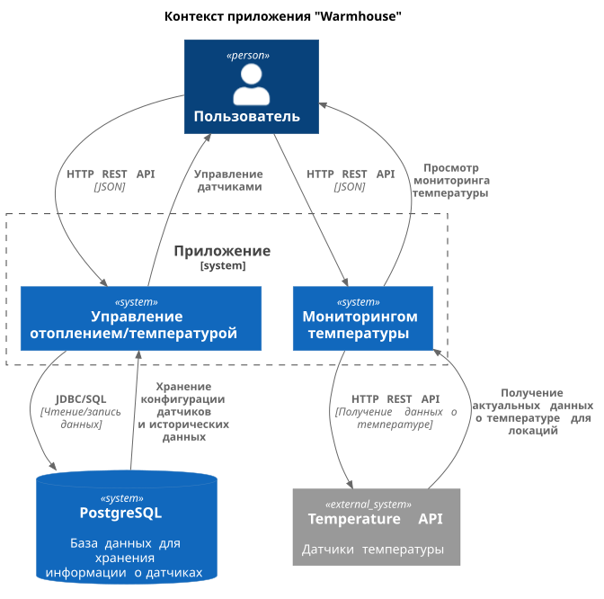
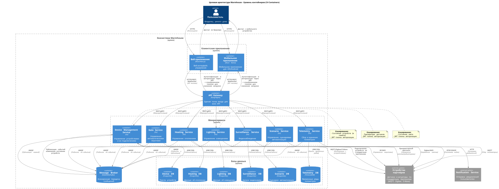
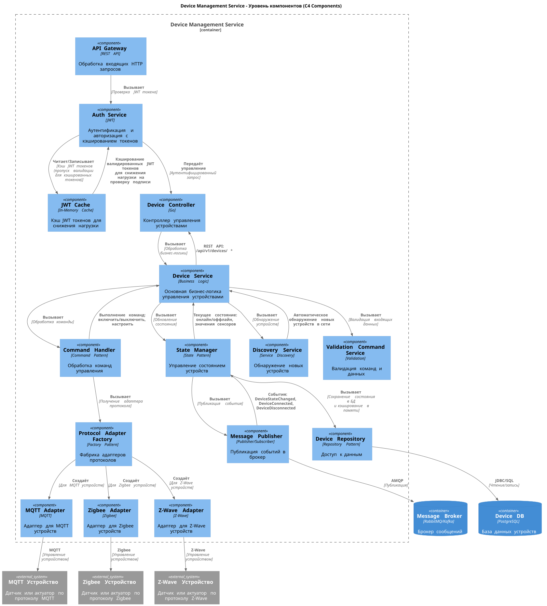
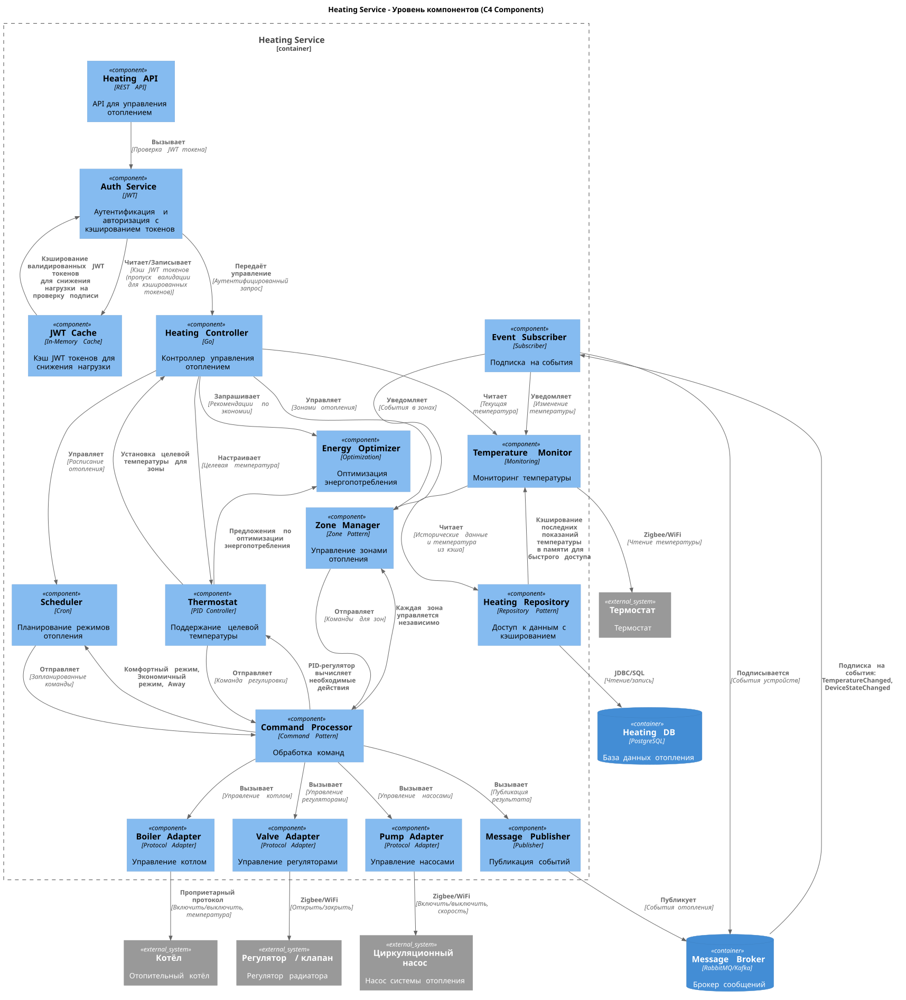
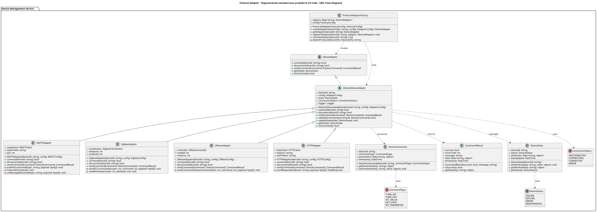
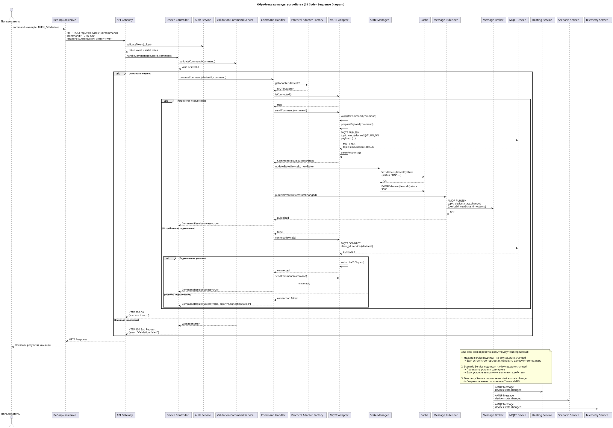
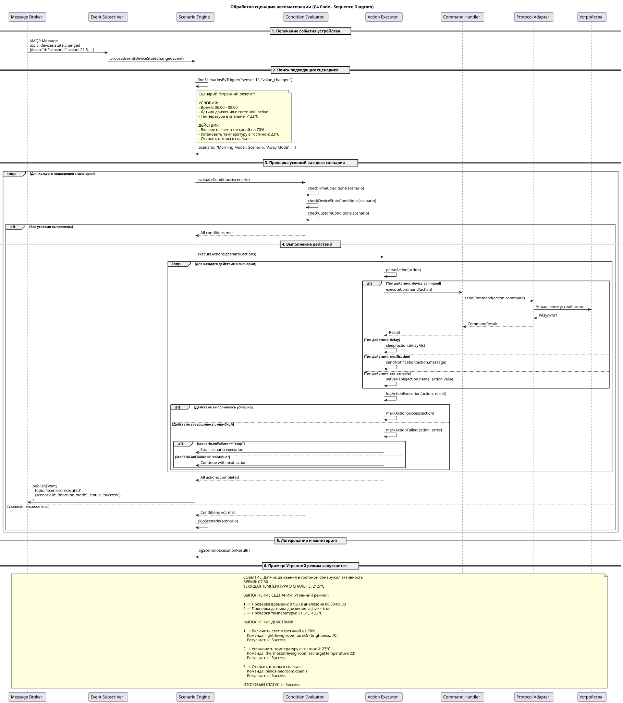
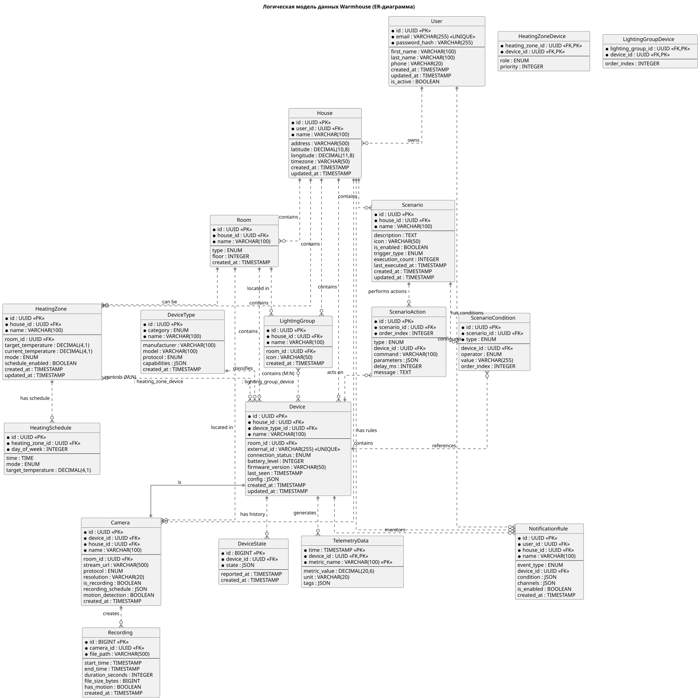

# Проектная работа: Микросервисная архитектура Warmhouse

Это проектная работа по рефакторингу монолитного приложения умного дома в микросервисную архитектуру.

# Задание 1. Анализ и планирование

## 1. Описание функциональности монолитного приложения

**Управление отоплением:**

- Пользователи могут управлять температурным режимом в отдельных комнатах (зонах отопления)
- Система поддерживает автоматическое переключение режимов: комфорт, эконом, вне дома, выключено
- Пользователи могут создавать расписания отопления по дням недели
- Система автоматически регулирует температуру на основе данных с датчиков температуры
- Поддержка сценариев автоматизации (например, "Утренний режим", "Ночной режим")

**Мониторинг температуры:**

- Пользователи могут просматривать текущую температуру в каждой комнате в реальном времени
- Система собирает исторические данные температуры для анализа
- Пользователи могут получать уведомления при выходе температуры за заданные пределы
- Поддержка множества датчиков в разных комнатах
- Отображение статистики и графиков температуры за период

## 2. Анализ архитектуры монолитного приложения

**Текущая архитектура:**

- **Язык программирования:** Go (Golang)
- **База данных:** PostgreSQL 16
- **Архитектурный стиль:** Монолитная трёхслойная архитектура
- **Организация кода:**
  - `handlers/` — HTTP обработчики (Controllers)
  - `services/` — бизнес-логика
  - `models/` — модели данных
  - `db/` — слой доступа к данным
- **Взаимодействие между компонентами:** Синхронное, через прямые вызовы функций
- **API:** REST API на порту 8080
- **Конфигурация:** Через переменные окружения
- **Внешние зависимости:** Внешний API для получения температуры (temperature-api на порту 8081)

## 3. Определение доменов и границы контекстов

На основе функционального анализа выделены следующие домены (Bounded Contexts):

### 1. User Domain (Пользовательский контекст)
- Управление пользователями, домами и помещениями

### 2. Device Domain (Управление устройствами)
- Управление физическими устройствами, их состояние и подключение

### 3. Heating Domain (Управление отоплением)
- Управление зонами отопления, температурными режимами, расписаниями

### 4. Lighting Domain (Управление освещением)
- Групповое управление освещением, создание сцен

### 5. Surveillance Domain (Видеонаблюдение)
- Управление камерами, запись видео, обнаружение движения

### 6. Scenario Domain (Сценарии автоматизации)
- Создание и выполнение сценариев автоматизации

### 7. Telemetry Domain (Телеметрия)
- Сбор и хранение временных рядов телеметрии

## 4. Проблемы монолитного решения

**Масштабируемость:**
- Весь монолит должен масштабироваться как единое целое
- Нельзя выделить ресурсы для нагруженных частей системы (например, телеметрия)
- Рост времени запуска и сборки при добавлении функциональности

**Разработка:**
- Любое изменение требует пересборки и redeploy всего приложения
- Сложность параллельной разработки разных команд
Большая кодовая база сложна для понимания новых разработчиков
- Увеличение времени исправления багов

**Надёжность:**
- Ошибка в одном модуле может привести к падению всей системы
- Отсутствие изоляции сбоев между доменами

**Производительность:**
- С ростом монолита, растет слоность запросов в обзую БД


## 5. Визуализация контекста системы — диаграмма С4

### Контекст системы



**Описание:**
- **User** — домашний пользователь, взаимодействует с системой через Web/Mobile приложение
- **Smart Home System** — монолитное приложение на Go, предоставляет REST API
- **Temperature Sensors** — внешние датчики температуры, предоставляющие данные через API
- **Database** — PostgreSQL для хранения всех данных

---

# Задание 2. Проектирование микросервисной архитектуры

## Диаграмма контейнеров



**Описание микросервисов:**

| Микросервис | Ответственность | Порт |
|------------|----------------|------|
| **API Gateway** | Единая точка входа, маршрутизация, аутентификация | 8080 |
| **Device Service** | Управление устройствами, команда, мониторинг состояния | 8081 |
| **Heating Service** | Управление отоплением, зонами, расписаниями | 8082 |
| **Lighting Service** | Управление освещением, группы, сцены | 8083 |
| **Surveillance Service** | Управление камерами, запись, обнаружение движения | 8084 |
| **Scenario Service** | Сценарии автоматизации, условия, действия | 8085 |
| **Telemetry Service** | Сбор и хранение телеметрии, временные ряды | 8086 |
| **Message Broker** | Асинхронная обработка событий, развязка сервисов | 5672 |

**Инфраструктура:**
- PostgreSQL базы данных для каждого микросервиса (Database per Service pattern)
- TimescaleDB для Telemetry Service
- RabbitMQ/Kafka как Message Broker
- In-Memory кэширование в каждом сервисе (JWT токены, состояние устройств)

## Диаграмма компонентов

### Device Management Service



**Основные компоненты:**
- **REST API Controller** — обработка HTTP запросов
- **Auth Service** — JWT аутентификация с кэшированием токенов
- **Device Service** — бизнес-логика управления устройствами
- **Protocol Adapter Factory** — создание адаптеров для разных протоколов (MQTT, Zigbee, Z-Wave)
- **State Manager** — управление текущим состоянием устройств с кэшированием
- **Repository** — доступ к данным в PostgreSQL
- **Message Publisher** — публикация событий в Message Broker

### Heating Service



**Основные компоненты:**
- **REST API Controller** — обработка HTTP запросов
- **Auth Service** — JWT аутентификация с кэшированием токенов
- **Zone Service** — бизнес-логика управления зонами отопления
- **Schedule Service** — управление расписаниями
- **Temperature Controller** — логика управления температурой
- **Device Integration** — взаимодействие с Device Service
- **Repository** — доступ к данным в PostgreSQL
- **Message Publisher/Subscriber** — отправка и получение событий

## Диаграмма кода (Code)

### Protocol Adapter Pattern



**Паттерн Adapter для поддержки множества протоколов устройств:**
- `ProtocolAdapter` — интерфейс адаптера
- `MqttAdapter` — реализация для MQTT устройств
- `ZigbeeAdapter` — реализация для Zigbee устройств
- `ZWaveAdapter` — реализация для Z-Wave устройств
- `ProtocolAdapterFactory` — фабрика для создания адаптеров
- `DeviceCommand` — DTO для команд устройствам

### Command Sequence Pattern



**Последовательность выполнения команды устройством:**
1. API Gateway получает HTTP запрос
2. Device Service обрабатывает запрос
3. Auth Service валидирует JWT (с кэшированием)
4. Device Service создаёт команду через ProtocolAdapterFactory
5. Адаптер отправляет команду устройству через соответствующий протокол
6. Состояние устройства обновляется и кэшируется
7. Событие публикуется в Message Broker

### Scenario Execution Sequence



**Последовательность выполнения сценария:**
1. Событие триггера (например, изменение состояния устройства)
2. Scenario Service получает событие через Message Broker
3. Scenario Engine находит подходящие сценарии
4. Каждое условие сценария проверяется
5. Если все условия выполнены, выполняются действия
6. Для каждого действия отправляется команда устройству
7. Результат выполнения публикуется в Message Broker

---

# Задание 3. Разработка ER-диаграммы

## ER-диаграмма Warmhouse (полная модель)



### Ключевые сущности

**Общие сущности:**
- **User** (Пользователь) — учётная запись пользователя системы
- **House** (Дом) — жилой объект, принадлежащий пользователю
- **Room** (Комната) — помещение в доме

**Устройства:**
- **DeviceType** (Тип устройства) — классификатор типов устройств
- **Device** (Устройство) — физическое устройство в доме
- **DeviceState** (Состояние устройства) — исторические данные состояния

**Доменные сущности:**
- **HeatingZone** (Зона отопления) — зона с автономным управлением температурой
- **HeatingSchedule** (Расписание отопления) — расписание для зоны
- **LightingGroup** (Группа освещения) — группа светильников
- **Camera** (Камера) — камера видеонаблюдения
- **Recording** (Запись) — видеозапись с камеры
- **Scenario** (Сценарий) — сценарий автоматизации
- **ScenarioCondition** (Условие сценария) — условие запуска
- **ScenarioAction** (Действие сценария) — действие при выполнении
- **TelemetryData** (Телеметрия) — данные временных рядов
- **NotificationRule** (Правило уведомления) — правило отправки уведомлений

# Задание 4. Создание и документирование API

### 1. Тип API

Для взаимодействия микросервисов в экосистеме Warmhouse используется гибридный подход:

**REST API** — для синхронных операций
- Немедленный ответ на запрос
- CRUD операции над ресурсами
- Управленческие команды
- Стандартный протокол HTTP/HTTPS
- Stateless — упрощает масштабирование

**AsyncAPI 2.6** — для асинхронных событий
- Развязка сервисов (loose coupling)
- Событийно-ориентированная архитектура
- Триггеры для сценариев автоматизации
- Телеметрические данные
- Множественные подписчики на одно событие

#### OpenAPI спецификации (REST API)

| Микросервис | Файл спецификации | Базовый URL |
|-------------|-------------------|-------------|
| **Device Management Service** | [`api-device-service.yaml`](docs/api/api-device-service.yaml) | `/device/v1` |
| **Heating Service** | [`api-heating-service.yaml`](docs/api/api-heating-service.yaml) | `/heating/v1` |
| **Scenario Service** | [`api-scenario-service.yaml`](docs/api/api-scenario-service.yaml) | `/scenario/v1` |
| Lighting Service | (будет добавлен) | `/lighting/v1` |
| Gate Service | (будет добавлен) | `/gate/v1` |
| Surveillance Service | (будет добавлен) | `/surveillance/v1` |
| Telemetry Service | (будет добавлен) | `/telemetry/v1` |

#### AsyncAPI спецификации (События)

| Описание | Файл спецификации |
|----------|-------------------|
| **Событийная шина (RabbitMQ/Kafka)** | [`asyncapi-events.yaml`](docs/api/asyncapi-events.yaml) |

#### Основные события

| Топик | Описание | Подписчики |
|-------|----------|------------|
| `device.state.changed` | Изменение состояния устройства | Scenario Service |
| `device.connected` | Подключение устройства | - |
| `device.disconnected` | Отключение устройства | - |
| `heating.mode.changed` | Изменение режима отопления | - |
| `heating.temperature.target.changed` | Изменение целевой температуры | - |
| `scenario.executed` | Сценарий выполнен | Scenario Service |
| `scenario.failed` | Сценарий завершён с ошибкой | Scenario Service |
| `surveillance.motion.detected` | Обнаружено движение | - |
| `telemetry.data.received` | Получены телеметрические данные | Telemetry Service |

---

# Задание 5. Работа с docker и docker-compose

## Реализовано temperature-api приложение

### Описание

Создано Spring Boot приложение `temperature-api` для имитации работы удалённых датчиков температуры.

### Функциональность

**Endpoint:** `GET /temperature`

**Параметры запроса:**
- `location` — название комнаты (опционально)
- `sensorId` — идентификатор датчика (опционально)

**Логика маппинга:**

Если `location` не указан, используется значение по умолчанию на основе `sensorId`:
- `sensorId = "1"` → `"Living Room"`
- `sensorId = "2"` → `"Bedroom"`
- `sensorId = "3"` → `"Kitchen"`
- иначе → `"Unknown"`

Если `sensorId` не указан, генерируется на основе `location`:
- `"Living Room"` → `"1"`
- `"Bedroom"` → `"2"`
- `"Kitchen"` → `"3"`
- иначе → `"0"`

**Ответ:** JSON с рандомной температурой от 15°C до 30°C

```json
{
  "sensorId": "1",
  "location": "Living Room",
  "temperature": 22.5,
  "unit": "C"
}
```

### Запуск приложения

```bash
cd apps
docker compose up -d
```

### Проверка работы

**Проверка temperature-api:**
```bash
# Без параметров (по умолчанию Living Room, sensorId 1)
curl http://localhost:8081/temperature

# С указанием location
curl http://localhost:8081/temperature?location=Kitchen

# С указанием sensorId
curl http://localhost:8081/temperature?sensorId=2

# С двумя параметрами
curl http://localhost:8081/temperature?location=Bedroom&sensorId=2
```

**Ожидаемый ответ (каждый раз разная температура):**
```json
{"sensorId":"1","location":"Living Room","temperature":"22.3","unit":"C"}
{"sensorId":"3","location":"Kitchen","temperature":"19.7","unit":"C"}
{"sensorId":"2","location":"Bedroom","temperature":"21.4","unit":"C"}
```

---